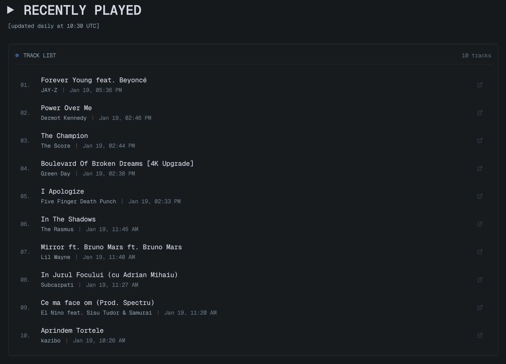
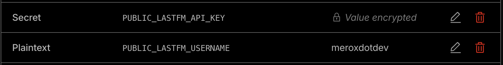
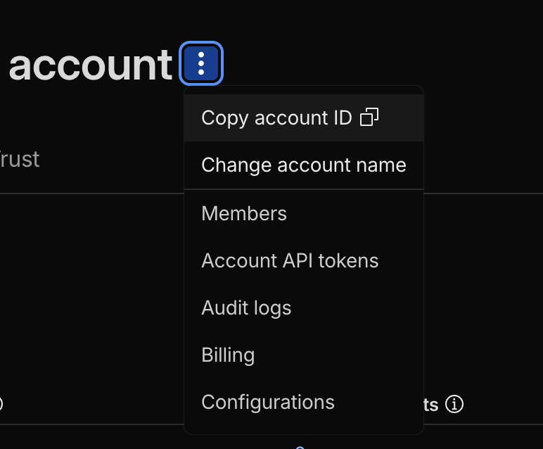

import Callout from '@/components/Callout.astro'
import AdSense from '@/components/AdSense.astro'

I wanted to add a "Recently Played" section to my website that automatically updates with my latest music. Instead of manually updating it every day, I built an automated system that fetches data from Last.fm and rebuilds my site daily using GitHub Actions.

**Here's what I'll cover:**
- Setting up Last.fm API integration
- Building the Tunes page with Astro
- Configuring environment variables in Cloudflare Pages
- Automating daily updates with GitHub Actions
- Using Web Scrobbler for YouTube on iOS/Mac

<AdSense />

## Why Last.fm?

Last.fm is perfect for this because it tracks everything you listen to across different platforms—Spotify, Apple Music, YouTube, and more. Once you connect your accounts, it automatically scrobbles (records) your listening history.

<Callout variant="tip">
**What is Scrobbling?** Scrobbling is Last.fm's term for automatically recording the music you listen to. Once set up, it works in the background without any manual input.
</Callout>

## Getting Your Last.fm API Key

First, you'll need a Last.fm API key:

1. Go to [Last.fm API Account](https://www.last.fm/api/account/create)
2. Fill in the application details (name, description, callback URL)
3. Copy your **API Key** and **Shared Secret**

<Callout variant="note">
The callback URL can be any valid URL—I used `https://merox.dev` for mine. It's mainly used for authentication flows, which we won't need for basic API access.
</Callout>

## Building the Tunes Page

I'm using **Astro** for my site, so I created a page that fetches Last.fm data at build time. Here's the core implementation:

### Creating the Last.fm Library

First, I created a utility library to handle Last.fm API requests in `src/lib/lastfm.ts`:

```typescript
const LASTFM_API_BASE = 'https://ws.audioscrobbler.com/2.0/'
const REQUEST_TIMEOUT_MS = 8000

async function lastFmRequest(params: Record<string, string>): Promise<any> {
  const apiKey = import.meta.env.PUBLIC_LASTFM_API_KEY
  if (!apiKey) {
    return null
  }

  try {
    const searchParams = new URLSearchParams({
      api_key: apiKey,
      format: 'json',
      ...params,
    })

    const url = `${LASTFM_API_BASE}?${searchParams.toString()}`
    const controller = new AbortController()
    const timeoutId = setTimeout(() => controller.abort(), REQUEST_TIMEOUT_MS)

    const response = await fetch(url, {
      headers: {
        'User-Agent': 'merox.dev/1.0',
      },
      signal: controller.signal,
    })

    clearTimeout(timeoutId)

    if (!response.ok) {
      return null
    }

    const data = await response.json()
    
    if (data.error) {
      return null
    }

    return data
  } catch (error) {
    return null
  }
}

export async function fetchRecentTracks(
  username?: string,
  limit: number = 10,
): Promise<LastFmTrack[]> {
  const user = username || import.meta.env.PUBLIC_LASTFM_USERNAME
  if (!user) {
    return []
  }

  const data = await lastFmRequest({
    method: 'user.getrecenttracks',
    user,
    limit: Math.min(limit, 200).toString(),
  })

  if (!data?.recenttracks?.track) {
    return []
  }

  const tracks = Array.isArray(data.recenttracks.track)
    ? data.recenttracks.track
    : [data.recenttracks.track]

  // Include tracks that have a date (played) OR are currently playing
  return tracks.filter((track: any) => track.date || track['@attr']?.nowplaying === 'true')
}
```

### The Tunes Page Component

The page fetches data at build time and displays it in a clean, retro-style interface. Here's the implementation in `src/pages/tunes.astro`:

```astro
---
import { fetchRecentTracks, fetchUserInfo } from '@/lib/lastfm'

let recentTracks: LastFmTrack[] = []
let userInfo = null
let hasLastFm = false

try {
  const username = import.meta.env.PUBLIC_LASTFM_USERNAME
  const apiKey = import.meta.env.PUBLIC_LASTFM_API_KEY

  if (username && apiKey) {
    hasLastFm = true
    const [tracksResult, userInfoResult] = await Promise.allSettled([
      fetchRecentTracks(username, 10),
      fetchUserInfo(username),
    ])

    recentTracks = tracksResult.status === 'fulfilled' ? tracksResult.value : []
    userInfo = userInfoResult.status === 'fulfilled' && userInfoResult.value ? userInfoResult.value : null
  }
} catch (error) {
  // Silently fail in production
}
---

<Layout class="max-w-4xl">
  <PageHead slot="head" title="Tunes" />
  
  <section>
    <h1>▶ recently played</h1>
    {hasLastFm && (
      <p>[updated daily at 15:30 Romania time]</p>
    )}

    {recentTracks.map((track, index) => (
      <div key={index}>
        <a href={track.url} target="_blank" rel="noopener">
          <span>{track.name}</span>
          <span>{track.artist['#text']}</span>
          {track.date && (
            <time>{formatLastFmDate(track.date.uts)}</time>
          )}
        </a>
      </div>
    ))}
  </section>
</Layout>
```

Here's how the final Tunes page looks on my site:



<AdSense />

## Configuring Environment Variables in Cloudflare Pages

Since I'm hosting on **Cloudflare Pages**, I need to set environment variables securely:

1. Go to your Cloudflare Pages project
2. Navigate to **Settings** → **Environment Variables**
3. Add these variables:
   - `PUBLIC_LASTFM_USERNAME` - Your Last.fm username
   - `PUBLIC_LASTFM_API_KEY` - Your Last.fm API key

Here's how the environment variables look in my Cloudflare Pages dashboard:



<Callout variant="tip">
**Why PUBLIC_ prefix?** In Astro (and Vite), environment variables prefixed with `PUBLIC_` are exposed to the client-side code. Since we're fetching at build time, this is safe and necessary.
</Callout>

These variables are only accessible during the build process and won't be exposed in your client-side JavaScript.

## Automating Daily Updates with GitHub Actions

The tricky part was getting Cloudflare Pages to rebuild daily. Initially, I tried triggering rebuilds via Git commits, but Cloudflare Pages doesn't always detect empty commits or small file changes reliably. The most reliable solution is to use **Cloudflare Pages API** to trigger rebuilds directly.

Here's my `.github/workflows/update-music.yml`:

```yaml
name: Update Tunes Page

on:
  schedule:
    # Run daily at 13:30 UTC (15:30 Romania time - EET / 16:30 EEST)
    - cron: '30 13 * * *'
  workflow_dispatch: # Allow manual trigger

jobs:
  update:
    runs-on: ubuntu-latest
    
    steps:
      - name: Trigger Cloudflare Pages rebuild via API
        env:
          CLOUDFLARE_API_TOKEN: ${{ secrets.CLOUDFLARE_API_TOKEN }}
          CLOUDFLARE_ACCOUNT_ID: ${{ secrets.CLOUDFLARE_ACCOUNT_ID }}
          CLOUDFLARE_PROJECT_NAME: ${{ secrets.CLOUDFLARE_PROJECT_NAME }}
        run: |
          if [ -z "$CLOUDFLARE_API_TOKEN" ] || [ -z "$CLOUDFLARE_ACCOUNT_ID" ] || [ -z "$CLOUDFLARE_PROJECT_NAME" ]; then
            echo "Error: Cloudflare API credentials are missing!"
            echo "Please set CLOUDFLARE_API_TOKEN, CLOUDFLARE_ACCOUNT_ID, and CLOUDFLARE_PROJECT_NAME as GitHub secrets."
            exit 1
          fi
          
          echo "Triggering Cloudflare Pages rebuild via API..."
          RESPONSE=$(curl -s -w "\n%{http_code}" -X POST \
            "https://api.cloudflare.com/client/v4/accounts/${CLOUDFLARE_ACCOUNT_ID}/pages/projects/${CLOUDFLARE_PROJECT_NAME}/deployments" \
            -H "Authorization: Bearer ${CLOUDFLARE_API_TOKEN}" \
            -H "Content-Type: application/json" \
            -d '{"branch":"main"}')
          
          HTTP_CODE=$(echo "$RESPONSE" | tail -n1)
          BODY=$(echo "$RESPONSE" | sed '$d')
          
          if [ "$HTTP_CODE" -eq 200 ] || [ "$HTTP_CODE" -eq 201 ]; then
            echo "✅ Successfully triggered Cloudflare Pages rebuild!"
            echo "$BODY" | jq '.' 2>/dev/null || echo "$BODY"
          else
            echo "❌ Failed to trigger rebuild. HTTP Status: $HTTP_CODE"
            echo "$BODY"
            exit 1
          fi
```

<Callout variant="tip">
**Why Cloudflare API?** Using the API is more reliable than Git commits because it directly triggers a rebuild without depending on Cloudflare detecting file changes. It's also faster and doesn't clutter your Git history with timestamp commits.
</Callout>

### Setting Up Cloudflare API Credentials

You'll need three pieces of information from Cloudflare:

#### 1. Get Your Account ID

1. Go to [Cloudflare Dashboard](https://dash.cloudflare.com/) → **Account home**
2. Select the menu button at the end of the account row
3. Select **Copy account ID**



#### 2. Get Your Project Name

1. Go to [Cloudflare Dashboard](https://dash.cloudflare.com/)
2. Navigate to **Workers & Pages** → **Pages**
3. Click on your project
4. Your **Project Name** is displayed in the project overview page
   - You can also find it in the URL: `https://dash.cloudflare.com/.../pages/view/your-project-name`
   - Make sure to use the exact name as shown (it's case-sensitive)

#### 3. Create an API Token

1. Go to [Cloudflare API Tokens](https://dash.cloudflare.com/profile/api-tokens)
2. Click **Create Token**
3. Click **Create Custom Token**
4. Configure the token:
   - **Token name**: `GitHub Actions - Pages Deploy`
   - **Permissions**:
     - **Account** → **Cloudflare Pages** → **Edit**
   - **Account Resources**:
     - **Include** → **Specific account** → Select your account
5. Click **Continue to summary** → **Create Token**
6. **Copy the token immediately** (you won't be able to see it again!)

#### 4. Add Secrets to GitHub

1. Go to your GitHub repository
2. Navigate to **Settings** → **Secrets and variables** → **Actions**
3. Click **New repository secret** and add:
   - `CLOUDFLARE_API_TOKEN` → Paste your API token
   - `CLOUDFLARE_ACCOUNT_ID` → Paste your Account ID
   - `CLOUDFLARE_PROJECT_NAME` → Paste your project name (e.g., `merox`)

<Callout variant="warning">
**Important:** Make sure your project name matches exactly. It's case-sensitive and should be the same as shown in your Cloudflare Pages dashboard.
</Callout>

<AdSense />

## Setting Up Web Scrobbler for YouTube

I listen to a lot of music on YouTube, especially on iOS and Mac. To track those plays, I use **Web Scrobbler**, a browser extension that scrobbles music from various websites.

### For Desktop (Chrome/Edge/Firefox)

1. Install [Web Scrobbler](https://webscrobbler.com/) extension
2. Connect your Last.fm account in the extension settings
3. Enable scrobbling for YouTube
4. That's it—it works automatically!

### For iOS/Mac Safari

Safari doesn't support extensions the same way, but here's what I do:

**Option 1: Use a different browser**
- Install Chrome or Firefox on your Mac
- Use Web Scrobbler extension there
- Most YouTube listening happens on desktop anyway

**Option 2: Manual scrobbling (for important tracks)**
- Use the Last.fm mobile app to manually scrobble
- Or use [Open Scrobbler](https://openscrobbler.com/) for quick manual entries

**Option 3: Use MusicBrainz Picard** (for downloaded music)
- If you download music, Picard can scrobble automatically
- Works great for local music libraries

<Callout variant="tip">
**Pro Tip:** If you're primarily on iOS, consider using Apple Music or Spotify with Last.fm integration. Both platforms have built-in Last.fm scrobbling that works seamlessly on mobile devices.
</Callout>

## How It All Works Together

Here's the complete flow:

1. **You listen to music** → Last.fm tracks it (via Spotify, Apple Music, Web Scrobbler, etc.)
2. **GitHub Actions runs daily** → Creates a commit with updated timestamp
3. **Cloudflare Pages detects the change** → Triggers a new build
4. **During build** → Astro fetches fresh data from Last.fm API
5. **Site updates** → Your Tunes page shows the latest tracks

The whole process is automated—you don't need to do anything after the initial setup.

## Troubleshooting

### Tracks Not Updating

- Check that your Last.fm account is actually receiving scrobbles
- Verify environment variables are set correctly in Cloudflare Pages
- Check GitHub Actions logs to see if the workflow ran successfully

### Build Failing

- Ensure your Last.fm API key is valid
- Check that `PUBLIC_LASTFM_USERNAME` matches your actual Last.fm username
- Review Cloudflare Pages build logs for specific errors

### Web Scrobbler Not Working

- Make sure the extension is enabled for the website
- Check that you're logged into Last.fm in the extension
- Try refreshing the page after enabling scrobbling

## Final Thoughts

This setup has been running smoothly for months. The page updates automatically every day, and I never have to think about it. It's a great example of how automation can make your website more dynamic without adding maintenance overhead.

If you're interested in seeing it in action, check out my [Tunes page](https://merox.dev/tunes/). The code is also available in my [GitHub repository](https://github.com/meroxdotdev/merox) if you want to see the full implementation.

<Callout variant="tip">
**Want to customize it?** The Last.fm API supports many other endpoints—top artists, top albums, listening stats, and more. You can easily extend this setup to show additional music data on your site.
</Callout>

## Resources

- [Last.fm API Documentation](https://www.last.fm/api)
- [Web Scrobbler Extension](https://webscrobbler.com/)
- [GitHub Actions Documentation](https://docs.github.com/en/actions)
- [Cloudflare Pages Environment Variables](https://developers.cloudflare.com/pages/platform/build-configuration/#environment-variables)
