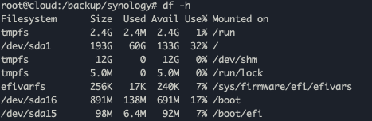
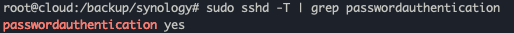
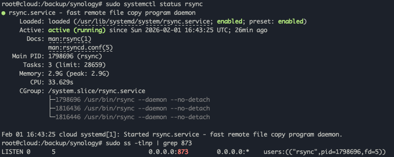
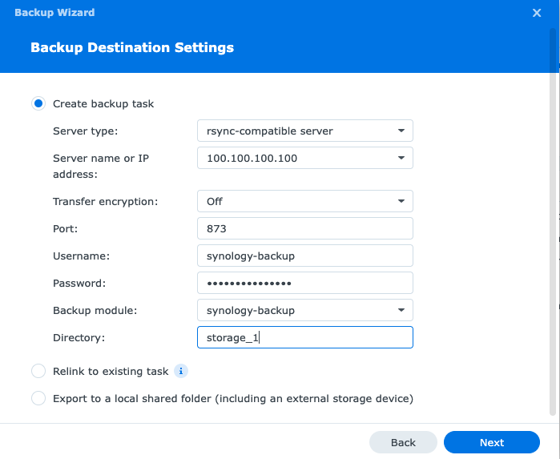
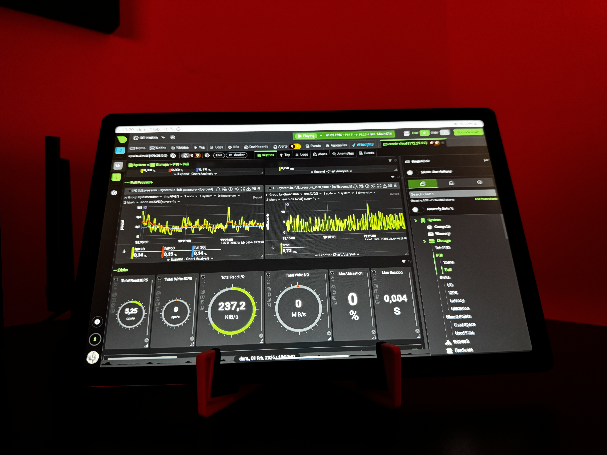

import Callout from '@/components/Callout.astro'
import AdSense from '@/components/AdSense.astro'

When Oracle Cloud announced their generous Always Free tier with ARM-based Ampere instances offering up to 4 OCPUs and 24GB RAM, it opened up incredible opportunities for homelab enthusiasts. Combined with 200GB of block storage and unlimited ingress traffic, it's the perfect platform for off-site Synology NAS backups—completely free.

But there's a catch: Oracle Cloud's security defaults are aggressive, and getting Synology HyperBackup to work with rsync over SSH requires specific configuration steps that aren't immediately obvious.

<Callout variant="note">
This guide assumes you already have an Oracle Cloud Always Free instance running Ubuntu and Tailscale configured for secure connectivity. If you're new to Tailscale, check out their [homelab documentation](https://tailscale.com/use-cases/homelab) first—it's a game-changer for secure remote access without port forwarding.
</Callout>

## Why This Setup?

After exploring various backup solutions, this configuration offers the best balance of security, cost, and reliability:

- **Zero cost**: Oracle Cloud Always Free tier + Tailscale free tier
- **Secure**: Encrypted over Tailscale VPN, no public exposure
- **Reliable**: rsync's incremental backups minimize transfer time
- **Flexible**: 200GB block storage with 5 volume backups included

The alternative would be Synology C2 or other cloud backup services, but those cost $60-120/year for similar storage. With Oracle Cloud, it's completely free forever.

<AdSense />

## Prerequisites

- Synology NAS with HyperBackup package installed
- Oracle Cloud Always Free account with Ubuntu instance
- Tailscale installed on both NAS and Oracle Cloud instance
- Basic SSH access to your Ubuntu instance

## The Oracle Cloud SSH Challenge

Here's where most guides fail: Oracle Cloud disables password authentication by default in `/etc/ssh/sshd_config`, but HyperBackup needs it to establish initial connections before you can set up SSH keys.

When I first tried connecting, I hit this error:

```bash
ash-4.4# ssh synology-backup@100.100.100.100
synology-backup@100.72.22.38: Permission denied (publickey).
```

The issue? Oracle Cloud's SSH configuration explicitly blocks password authentication, even if you think you've enabled it.

## Setting Up the Ubuntu Server

### 1. Install Required Packages

```bash
sudo apt update
sudo apt install rsync openssh-server -y
sudo systemctl enable ssh
sudo systemctl start ssh
```

### 2. Create Dedicated Backup User

Never use root for backups. Create a dedicated user with minimal permissions:

```bash
sudo useradd -m -s /bin/bash synology-backup
sudo passwd synology-backup
# Set a strong password
```

### 3. Create Backup Directory

```bash
sudo mkdir -p /backup/synology
sudo chown synology-backup:synology-backup /backup/synology
sudo chmod 750 /backup/synology

# Verify available space (you should see ~136GB free)
df -h /
```



### 4. Fix Oracle Cloud SSH Configuration

This is the critical step. Oracle Cloud uses configuration includes that override your main `sshd_config` file:

```bash
# Check for override files
ls -la /etc/ssh/sshd_config.d/

# You'll likely see 50-cloud-init.conf or similar
sudo nano /etc/ssh/sshd_config.d/50-cloud-init.conf
```

Change these lines:

```bash
# FROM:
PasswordAuthentication no

# TO:
PasswordAuthentication yes
```

Also ensure these are set in the main config:

```bash
sudo nano /etc/ssh/sshd_config
```

Add or modify:

```bash
PasswordAuthentication yes
PubkeyAuthentication yes
KbdInteractiveAuthentication yes
UsePAM yes
PermitRootLogin no
```

Restart SSH (note: it's `ssh` not `sshd` on Ubuntu):

```bash
sudo systemctl restart ssh
```

### 5. Verify Configuration

This is crucial—verify the active configuration:

```bash
sudo sshd -T | grep passwordauthentication
# Should show: passwordauthentication yes
```

If it still shows "no", check for other override files:

```bash
sudo grep -r "PasswordAuthentication" /etc/ssh/
```



## Test Connection from Synology

SSH into your Synology NAS and test:

```bash
# Test SSH connection
ssh synology-backup@100.72.22.38
# Should prompt for password

# Test rsync
rsync -avz --dry-run /volume1/homes/ synology-backup@100.72.22.38:/backup/synology/test/
```


<Callout variant="tip">
If you still can't connect, check Oracle Cloud Security Lists. By default, they allow SSH from anywhere, but if you've modified them, ensure your Tailscale subnet (100.0.0.0/8) is allowed.
</Callout>

## Configuring rsync Daemon (Recommended)

While SSH-based rsync works, HyperBackup's UI works better with rsync daemon mode, which provides module discovery and better integration.

### 1. Create rsync Configuration

```bash
sudo nano /etc/rsyncd.conf
```

Add this configuration:

```conf
uid = synology-backup
gid = synology-backup
use chroot = no
max connections = 10
pid file = /var/run/rsyncd.pid
log file = /var/log/rsyncd.log
timeout = 300

[synology_backup]
path = /backup/synology
comment = Synology HyperBackup Storage
read only = no
list = yes
auth users = synology-backup
secrets file = /etc/rsyncd.secrets
hosts allow = 100.0.0.0/8
```

<Callout variant="note">
The `hosts allow` line restricts access to Tailscale IPs only (100.0.0.0/8 subnet). This ensures only devices on your Tailscale network can connect.
</Callout>

### 2. Create Credentials File

```bash
sudo nano /etc/rsyncd.secrets
```

Add (replace with your actual password):

```
synology-backup:YOUR_STRONG_PASSWORD_HERE
```

Set proper permissions:

```bash
sudo chmod 600 /etc/rsyncd.secrets
sudo chown root:root /etc/rsyncd.secrets
```

### 3. Enable and Start rsync Daemon

```bash
sudo systemctl enable rsync
sudo systemctl start rsync

# Verify it's running
sudo systemctl status rsync

# Check it's listening on port 873
sudo ss -tlnp | grep 873
```



### 4. Test rsync Daemon from Synology

```bash
# List available modules
rsync synology-backup@100.72.22.38::

# Should show:
# synology_backup    Synology HyperBackup Storage

# Test with password
export RSYNC_PASSWORD='YOUR_PASSWORD'
rsync -avz --dry-run /volume1/homes/merox/ synology-backup@100.72.22.38::synology_backup/test/
```

## Configuring HyperBackup

Now for the easy part—setting up HyperBackup to use your Oracle Cloud instance.

### 1. Create Backup Task

1. Open **HyperBackup** in DSM
2. Click **+** (Create backup task)
3. Select **Folders and packages**
4. Choose **rsync** as the file server
5. Select **Multiple versions** (recommended for versioning)
6. Choose **rsync-compatible server**

### 2. Connection Settings

Here's where the rsync daemon configuration pays off:

**Server Configuration:**
- **Server name or IP address:** `100.72.22.38` (your Tailscale IP)
- **Port:** `873` (not 22!)
- **Transfer encryption:** ❌ **Disabled** (Tailscale already encrypts)
- **Username:** `synology-backup`
- **Password:** Your password from `/etc/rsyncd.secrets`

**Backup Location:**
- **Backup module:** Click and select `synology_backup`
- **Directory:** Leave blank or add a subfolder like `nas-backup`



<Callout variant="warning">
**Critical:** When using rsync daemon (port 873), you MUST disable "Transfer encryption". The option tries to use SSH which isn't available on port 873. Don't worry—Tailscale provides encryption at the network level.
</Callout>

### 3. Select Backup Data

Choose the folders you want to backup. For a typical setup:

- `/homes` - User home directories
- `/photo` - Photo library
- `/documents` - Important documents
- `/docker` - Docker configurations (if using Docker)

### 4. Backup Settings


**Recommended settings:**
- **Task name:** `Oracle Cloud Backup`
- **Compress backup data:** ✅ Enabled (saves bandwidth and storage)
- **Enable backup schedule:** ✅ Enabled
  - **Schedule:** Daily at 2-3 AM (off-peak hours)
- **Enable integrity check schedule:** ✅ Enabled
  - **Schedule:** Weekly on Saturday evenings
- **Enable client-side encryption:** ✅ **Highly Recommended**

<Callout variant="tip">
**Client-side encryption** is crucial! Even though Tailscale encrypts the transfer, client-side encryption protects your data at rest. If someone gains access to your Oracle Cloud instance, they can't read your backups without your encryption password.
</Callout>

### 5. Rotation Settings


**Smart Recycle with version limits:**
- **Maximum number of versions:** 3-5 (adjust based on your 200GB limit)
- **Smart Recycle:** Enabled (automatically removes oldest versions when space is low)

With 136GB available and smart rotation, you can comfortably backup 50-100GB of data with multiple versions.

## Monitoring and Maintenance

### Check Backup Status

On Ubuntu, monitor your backups:

```bash
# View backup size
du -sh /backup/synology/*

# Monitor in real-time during backup
watch -n 10 du -sh /backup/synology

# Check what's being backed up
ls -lah /backup/synology/
```

### Monitor with Netdata

If you noticed in my Oracle Cloud instance, I have Netdata running. It's perfect for monitoring:

```bash
# Access at: http://100.72.22.38:19999
```

Netdata shows:
- Disk I/O during backups
- Network traffic over Tailscale
- Storage usage trends
- System load



### View Logs

```bash
# rsync daemon logs
sudo tail -f /var/log/rsyncd.log

# SSH authentication logs
sudo tail -f /var/log/auth.log | grep synology-backup
```

## Troubleshooting Common Issues

### "Failed to connect to backup destination"

**Cause:** Transfer encryption enabled with rsync daemon

**Fix:** Disable "Transfer encryption" in HyperBackup when using port 873

### "Permission denied (publickey)"

**Cause:** Oracle Cloud's SSH config overrides

**Fix:** Check `/etc/ssh/sshd_config.d/` for override files and verify with `sudo sshd -T | grep passwordauthentication`

### Backup Slower Than Expected

**Causes:**
- First backup transfers everything (takes hours)
- Tailscale relay instead of direct connection
- Synology CPU limited

**Monitoring:**
```bash
# On Oracle Cloud, check network speed
sudo iftop -i tailscale0

# On Synology, check HyperBackup logs
cat /var/log/synopkg.log | grep HyperBackup
```

**Solutions:**
- Ensure Tailscale uses direct connection (check `tailscale status`)
- Schedule backups during low-usage periods
- Enable compression in HyperBackup (reduces data transfer)

### Running Out of Space

**Check usage:**
```bash
# See what's using space
du -h /backup/synology/ | sort -rh | head -20

# Check available space
df -h /
```

**Solutions:**
- Reduce version retention in HyperBackup rotation settings
- Exclude large unnecessary folders (media caches, temp files)
- Delete old backups manually if needed

## Security Best Practices

### 1. Use SSH Keys (Optional but Recommended)

After confirming password authentication works, migrate to SSH keys:

**On Synology:**
```bash
ssh-keygen -t ed25519 -C "synology-hyperbackup"
cat ~/.ssh/id_ed25519.pub
```

**On Ubuntu:**
```bash
sudo su - synology-backup
mkdir -p ~/.ssh
nano ~/.ssh/authorized_keys
# Paste Synology's public key
chmod 600 ~/.ssh/authorized_keys
exit
```

Then disable password authentication:
```bash
sudo nano /etc/ssh/sshd_config.d/50-cloud-init.conf
# Change back to: PasswordAuthentication no
sudo systemctl restart ssh
```

### 2. Firewall Configuration

Since everything is over Tailscale, you don't need to open ports publicly:

```bash
# If you have ufw enabled, allow SSH only from Tailscale
sudo ufw allow from 100.0.0.0/8 to any port 22
sudo ufw allow from 100.0.0.0/8 to any port 873
```

### 3. Regular Updates

Keep your Oracle Cloud instance updated:

```bash
# Weekly updates
sudo apt update && sudo apt upgrade -y

# Enable unattended security updates
sudo apt install unattended-upgrades -y
sudo dpkg-reconfigure -plow unattended-upgrades
```

### 4. Backup the Encryption Key

**CRITICAL:** If you enabled client-side encryption in HyperBackup, **save your encryption password in a password manager**. Without it, your backups are permanently unrecoverable.

## Why This Setup Works in 2026

This configuration aligns with several key trends in homelab and backup strategies:

### Oracle Cloud's Generous Free Tier

Oracle's commitment to their Always Free tier remains strong into 2026. Unlike other providers who've quietly reduced free offerings, Oracle continues providing:
- 4 OCPUs Ampere A1 compute
- 24GB RAM
- 200GB block storage
- Unlimited ingress traffic
- 10TB monthly egress

This makes it one of the best platforms for cost-free off-site backups.

### Tailscale's Growing Adoption

Tailscale has become the de facto standard for homelab networking in 2026. Its zero-config approach and WireGuard-based performance have made traditional VPN setups obsolete for personal use. The free tier's 100-device limit is more than enough for most homelabs.

### The 3-2-1-1-0 Backup Strategy

Modern backup best practices have evolved to 3-2-1-1-0:
- **3** copies of data
- **2** different media types
- **1** copy off-site (Oracle Cloud satisfies this)
- **1** copy offline/immutable (HyperBackup's versioning provides this)
- **0** errors in backups (HyperBackup's integrity checks ensure this)

This Oracle Cloud setup perfectly satisfies the off-site requirement without recurring costs.

### rsync's Reliability

Despite newer backup tools emerging, rsync remains the gold standard for incremental backups. Its efficiency, reliability, and ubiquity make it ideal for NAS backups. Synology's HyperBackup builds on rsync while adding versioning, encryption, and scheduling.

## Cost Analysis

Let's compare this setup to commercial alternatives:

**Commercial Cloud Backup (200GB):**
- Synology C2: $60/year
- Backblaze B2: $1.20/GB/month = $28.80/year (+ egress fees)
- AWS S3: $4.60/month = $55.20/year (+ egress fees)

**This Setup:**
- Oracle Cloud Always Free: $0
- Tailscale Free Tier: $0
- **Total: $0/year**

**Savings:** $60-300/year depending on chosen service and data transfer

<Callout variant="tip">
For a typical homelab with 50-100GB of important data, this setup saves $60-120 annually compared to commercial backup services, while providing the same (or better) security and control.
</Callout>

## Limitations to Consider

This setup isn't perfect for everyone:

### Storage Limits

200GB total block storage with 5 volume backups means you're limited to ~180GB for actual backup data (reserving some for OS and overhead). If you need more:
- Use multiple Oracle Cloud accounts (one per person in your household)
- Supplement with local backups
- Consider paid cloud storage for large media libraries

### Backup Speed

Incremental backups are fast, but initial uploads can take 8-24 hours for 100GB over residential internet. Plan accordingly:
- Start first backup on a weekend
- Use compression to reduce data transfer
- Schedule during off-peak hours

### No Official SLA

Oracle's Always Free tier has no SLA. While outages are rare, your backup destination could theoretically be unavailable when needed. Mitigate this with local backup copies.

## Conclusion

Setting up Synology HyperBackup with Oracle Cloud's Always Free tier provides a professional-grade, zero-cost off-site backup solution. The key challenges—Oracle Cloud's SSH configuration and HyperBackup's rsync daemon integration—are easily overcome with the right configuration.

After the initial setup, your backups run automatically, protected by both Tailscale's network encryption and HyperBackup's client-side encryption. Combined with local backup copies, you have a robust 3-2-1 backup strategy without monthly fees.

The combination of Oracle Cloud, Tailscale, and Synology HyperBackup creates a backup solution that would cost $60-120/year with commercial providers, completely free. For homelab enthusiasts in 2026, it's one of the best setups available.

## Resources

- [Oracle Cloud Always Free Tier](https://www.oracle.com/cloud/free/)
- [Tailscale Documentation](https://tailscale.com/kb/)
- [Synology HyperBackup Guide](https://www.synology.com/en-global/knowledgebase/DSM/help/HyperBackup/data_backup_create)
- [rsync Documentation](https://rsync.samba.org/documentation.html)

<Callout variant="note">
Have questions or run into issues? Feel free to reach out via [email](mailto:hello@merox.dev) or open a discussion on [GitHub](https://github.com/meroxdotdev)!
</Callout>